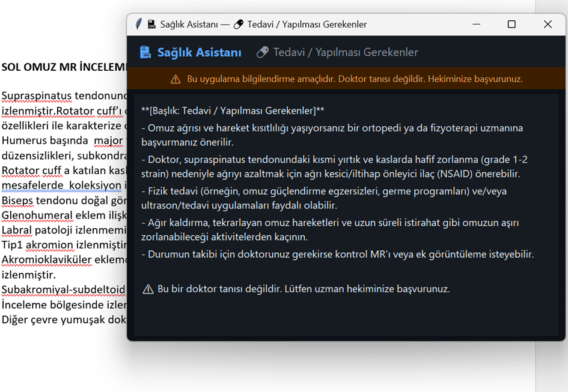
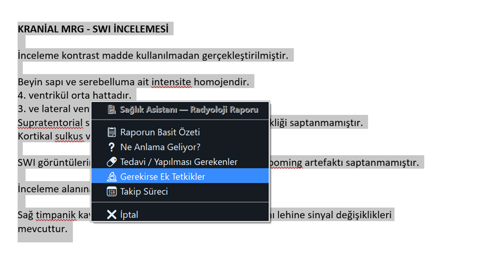
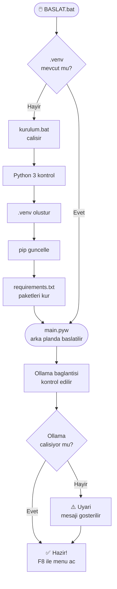
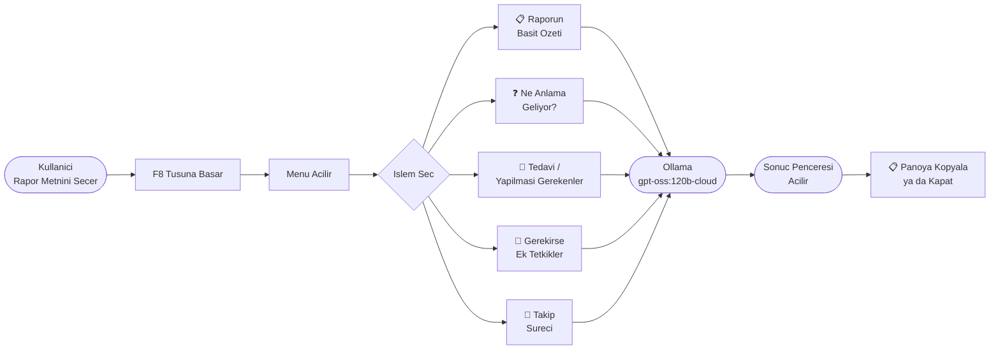

# Radyoloji Rapor Asistanı

<div align="center">

### Radyoloji Raporu Anlama Rehberi

`Radyoloji Raporu + F8 = Anlasılır Acıklama`

[](https://docs.ollama.com/quickstart)
[](https://ollama.com/library)
[](https://www.python.org/downloads/)

</div>

```text
 ____                 _             _             _   _     ____                                       _         _     _                    
|  _ \ __ _  __| |_   _  ___ | | ___ (_) (_) | | | |   |  _ \ __ _ _ __   ___  _ __      / \   ___(_)___| |_ __ _ _ __ (_)
| |_) / _` |/ _` | | | |/ _ \| |/ _ \| | | | | | | |   | |_) / _` | '_ \ / _ \| '__|    / _ \ / __| / __| __/ _` | '_ \| |
|  _ < (_| | (_| | |_| | (_) | | (_) | | | | | |_| |   |  _ < (_| | |_) | (_) | |      / ___ \\__ \ \__ \ || (_| | | | | |
|_| \_\__,_|\__,_|\__, |\___/|_|\___// | |_|  \___/    |_| \_\__,_| .__/ \___/|_|     /_/   \_\___/_|___/\__\__,_|_| |_|_|
                  |___/            |__/                           |_|                                                  
```

---

## 📸 Uygulama Önizleme

<div align="center">
  
  
</div>

> [!IMPORTANT]
> Bu uygulama **bilgilendirme** amaçlıdır. Doktor tanısı değildir. Sağlık kararlarınız için mutlaka uzman hekiminize başvurunuz.

---

## 0) Ogrenci Icin Tek Adim

1. Ollama'yi kur: https://docs.ollama.com/windows — ardından modeli indir:
   ```
   ollama pull gpt-oss:120b-cloud
   ```
2. Bu klasorde sadece `BASLAT.bat` calistir.
3. Herhangi bir programda rapor metnini sec → **F8** bas → islemi sec.

> [!IMPORTANT]
> `BASLAT.bat` gerekli durumda `kurulum.bat` dosyasini otomatik cagirir ve ortami kendi kurar. Ekstra komut gerekmez.

---

## 1) BASLAT Calisinca Ne Oluyor?



Ollama API varsayilan adresi: `http://localhost:11434`

Model oncelik sirasi:
1. `gpt-oss:120b-cloud`
2. `gpt-oss:120b`
3. `gpt-oss:latest`

---

## 2) Kullanim Akisi



---

## 3) Menu Secenekleri

| Secim | Aciklama |
|---|---|
| 📋 **Raporun Basit Ozeti** | Raporu sade Turkce ile ozetler, tıbbi terimleri aciklar |
| ❓ **Ne Anlama Geliyor?** | Bulgulari gunluk dilde açıklar, kesin tani koymaz |
| 💊 **Tedavi / Yapilmasi Gerekenler** | Genel tavsiyeler verir, doktora yonlendirir |
| 🔬 **Gerekirse Ek Tetkikler** | Rapor bulgularina gore ek muayene onerir |
| 📅 **Takip Sureci** | Kontrol sureci ve dikkat edilmesi gerekenleri anlatir |

---

## 4) Hata Cozme Kisa Notlari

- `Ollama'ya baglanamadi` hatasi → Terminalde `ollama serve` komutunu calistir
- `Model bulunamadi` hatasi → `ollama pull gpt-oss:120b-cloud` komutunu calistir
- `Secim bulunamadi` uyarisi → Once metni sec, sonra F8 bas
- Yavas cevap → Normal, 120b model buyuk; bekleme suresi 30-120 saniye olabilir

---

## 5) Dosya Yapisi

```
Saglik-Asistani/
├── main.pyw          ← Ana program (tkinter + pynput + Ollama)
├── BASLAT.bat        ← Baslatici
├── kurulum.bat       ← Kurulum scripti (ilk calismada otomatik tetiklenir)
├── requirements.txt  ← Python bagimlilikları
└── README.md         ← Bu dosya
```

---

## Kaynaklar (Resmi)

- Ollama Quickstart: https://docs.ollama.com/quickstart
- Ollama Windows: https://docs.ollama.com/windows
- Ollama Model Kutuphanesi: https://ollama.com/library
